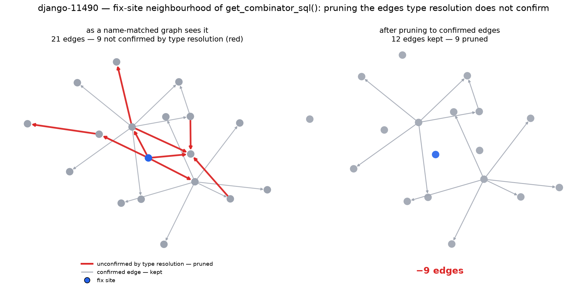
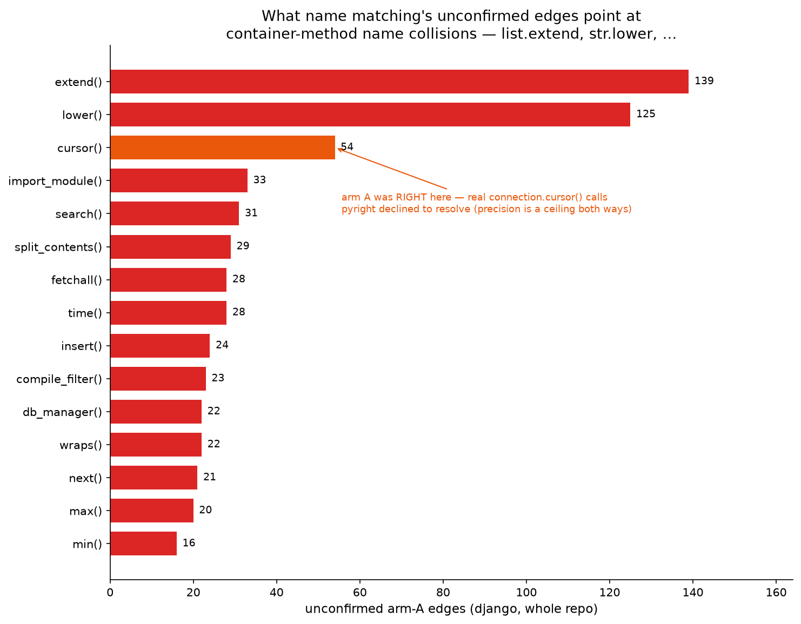
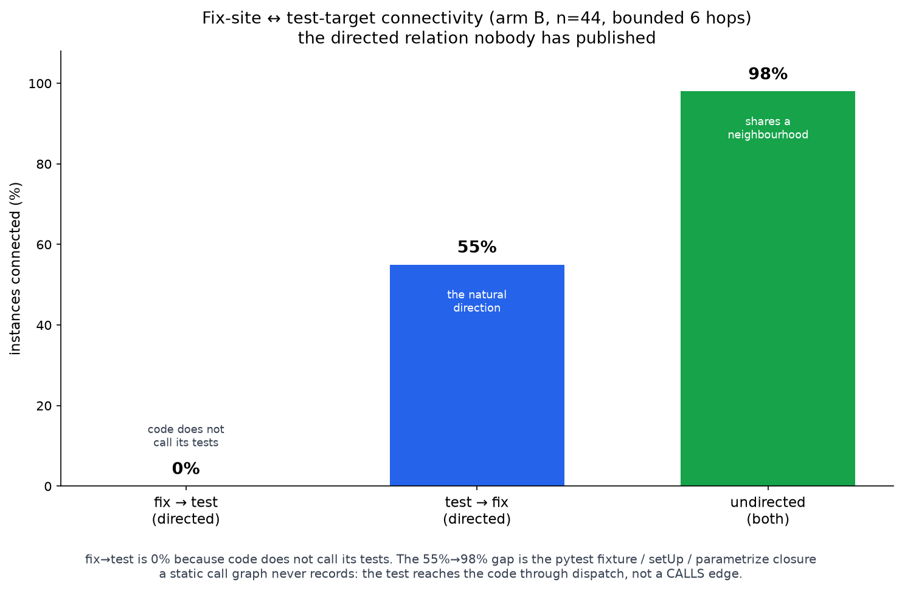
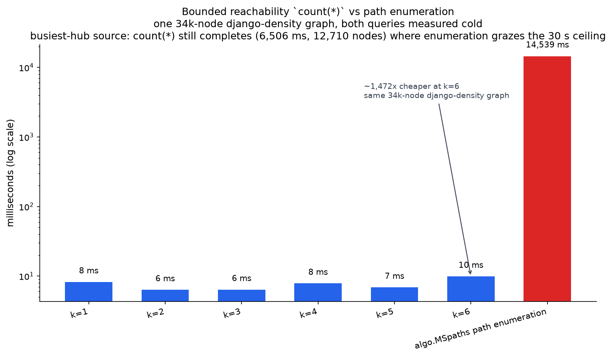

# Substrate Friction

**Every AI coding agent that reads your repository builds a graph of it first — and Aider's repo map, RepoGraph, and LocAgent all build that graph by matching identifier _names_. We built both arms of the same django commit — one name-matched, one type-resolved — and measured what name matching costs: a precision ceiling of `0.746`, recall `0.352` of the true graph, Jaccard `0.3143`. A quarter of a name-matched graph's in-scope edges do not survive contact with type resolution, and they fail in a structured, nameable way.**



_Above: the fix-site neighbourhood of `get_combinator_sql()` in `django__django-11490`. The name-matched arm draws **21** edges; type resolution confirms **12** and leaves **9** unconfirmed (red). **Four of those nine** red edges are one collision — `list.extend` name-bound to a GIS class. This is the whole thesis in one picture, and it is the `docs/demo.html` money shot._

This is a measurement of the **substrate** every localization and retrieval tool in this space stands on. It holds regardless of what you build on top. Everything else here — a directional connectivity finding, a graph engine used the way graphs want to be used, and an honestly-null failure predictor — is the scaffolding that produced the measurement and the results it produced along the way, reported without dressing up.

---

## What this is

Take one SWE-bench django ticket. To reason about it structurally you first need a call graph, and _how you build that graph_ is a choice with consequences nobody in this space has measured against a type-resolved reference on real code. We build the same repository two ways and compare them edge-for-edge:

- **Arm A — name-matched.** A call `x.foo()` becomes an edge to _every_ function named `foo`. This is how Aider's repo map, RepoGraph (arXiv 2410.14684), and LocAgent (arXiv 2503.09089) build their graphs.
- **Arm B — type-resolved.** The same repository indexed with `scip-python` (pyright-backed), so `x.foo()` resolves to `foo` on the _actual static type_ of `x`, or to nothing when the receiver's type is unknown.

Same repo, same commit, same extraction of definitions. Only edge resolution differs. Both arms are resident in one HydraDB engine at once, in disjoint id bands, so the comparison is a single-engine operation.

### Quickstart

```bash
git clone <repo> && cd substrate-friction
./setup.sh                                   # engine up, package installed, shipped
                                             # working set loaded, live gate warmed
friction check   --issue django__django-10554   # THE GATE: real count(*) Cypher + latency
friction compare --issue django__django-10973   # arm A (name-matched) vs arm B (type-resolved)
```

`setup.sh` runs from a clean clone with no manual steps (cold: about 77 s to a working gate — honest, not sub-60s). `friction compare`, `precision`, `connectivity`, `eval`, and `list` are cache-backed and read the committed `docs/` reports and `data/…/arms/` caches; they need no live engine. Only `friction check` and `friction serve` touch the running engine.

**CLI:** `friction check / compare / precision / connectivity / eval / list / serve`.
**API:** `GET /health /instances /check/{id} /compare/{id} /precision /connectivity`.

---

## Finding 1 — the substrate: what name matching costs

On django (commit `b9cf764`), arm A produced 18,774 call edges. Restricting to edges whose source is in scope and mappable onto the shared identity space leaves **5,873** arm-A edges to compare against arm B's internal edges:

| Measure | Value |
|---|---:|
| Compared (in scope) | **5,873** |
| Confirmed by arm B (both) | **4,381** |
| In arm A only, unconfirmed | **1,492** |
| True edges arm A missed (only in arm B) | **8,064** |
| **Arm A precision (ceiling)** | **0.746** |
| Arm A recall of the true graph | **0.352** |
| Jaccard | **0.3143** |

The unconfirmed edges are not random. They cluster on container-method names that collide across the codebase:



| Target | Unconfirmed | What it actually is |
|---|---:|---|
| `extend` | **139** | `list.extend` name-bound to a GIS class |
| `lower` | **125** | `str.lower` bound to `django.template.defaultfilters.lower` |
| `cursor` | **54** | the counter-example — see below |
| `import_module` | **33** | |
| `search` | **31** | |

A name matcher cannot tell `list.extend` from a GIS method called `extend`; it draws an edge to both. (In v1's tree-sitter graph the same failure wired Python's builtin `super()` to `django/template/loader_tags.py::BlockNode.super` **1,321 times** — see the retraction below.)

### `0.746` is a ceiling — read it in both directions

pyright emits **no** occurrence when a receiver's type is unknown; it never invents an edge. So an arm-A edge missing from arm B is _either_ a genuine false positive _or_ a real call pyright declined to resolve. The direction of arm B's bias is fixed: it under-reports. Therefore **true precision is `>= 0.746`, never `<=`.** State it that way every time the number appears.

The `cursor` block of **54** unconfirmed edges is the clean counter-example: real `self.connection.cursor()` calls on an untyped receiver, where pyright emits nothing and arm B under-reports. **Here arm A was right and the type-resolved graph is the incomplete one.** We report the ceiling as a ceiling precisely so this case is not hidden.

### What the wrong edges cost — a projection, not a measurement

Projected localization cost of a name-matched graph of this quality: **1.2pp to 2.0pp** of resolve rate (interval `[0.0119, 0.0197]` as a fraction of instances). This is **an analogy to ARISE's published ablation band, not a resolve-rate delta we measured** — we did not run SWE-bench.

- **Basis.** ARISE (arXiv 2605.03117) improved call-graph edge quality on SWE-bench Lite and moved end-to-end resolve **17.3% → 22.0%** and Function Recall@1 **0.43 → 0.60**. We map our measured edge quality onto that band by analogy, the way ARISE's own band is stated as an interval.
- **Corroborating, cited not reproduced.** SHERLOC (arXiv 2606.24820): +5.95pp mean and _negative_ transfer from bad localization. RGFL (arXiv 2601.18044): wrong-element localization implicated in **53%** of unresolved instances.

_Source: `docs/precision.md`, `docs/graph-delta.md`. Reproduce: `uv run python scripts/graph_delta.py --repo data/repos/django --out docs/graph-delta.md`._

---

## Finding 2 — direction: the relation every prior version measured backwards

Nobody has published this. Measured over 44 django instances that carry both a fix-site set and a test-target set, bounded at 6 hops:



| Direction | Connected | What it means |
|---|---:|---|
| **fix → test** (directed) | **0/44 (0%)** | Code does not call tests. The direction every prior spec used was backwards. |
| **test → fix** (directed) | **24/44 (55%)** | The clean semantic: tests call the code they exercise. |
| **undirected** | **43/44 (98%)** | "Shares a neighbourhood" — _not_ "the test exercises this code." |

Two consequences. First, `fix → test` is `0/44` because production code has no edge to the test that guards it; the natural directed relation is `test → fix` at **55%**. Second, the jump from `55%` to `98%` is the pytest fixture / `setUp` / `parametrize` / framework-dispatch closure: a test reaches its code through dispatch that a static call graph structurally cannot record. Dropping direction recovers those instances, but it recovers them by measuring a weaker, symmetric relation.

**Every v1/v2 friction number used `relDirection: 'both'`** and therefore measured the weaker "shares a neighbourhood" property, never directed `test → fix` coverage. Report the two measures separately; never present the undirected number as evidence a test covers a fix.

_Source: `docs/connectivity.md`._

---

## Finding 3 — the engine: bounded reachability is exact, flat, and ~2,500x faster than enumeration

The metric v2 asked for — the number of bounded paths between two node sets — is **#P-complete** (Valiant 1979). It is not slow; it is intractable, and on a dense django graph the engine's `algo.MSpaths` enumeration hit the hard **30,000 ms** timeout.

The fix is to ask a different, tractable question with the same intuition: **bounded reachable-set size**, computed in-engine as a masked-BFS `count(*)`.

```cypher
MATCH (s {id: 41000000000})-[:CALLS*1..6]->(n) RETURN count(*) AS n
```

Against a walk-correct networkx reference this is **exact at every k** and **flat in k**: **3–12 ms at k = 1..6** on an out-degree-3 graph — the same density where path enumeration timed out at 30,000 ms. That is roughly **2,500x**.



The exactness claim is a standing `@pytest.mark.engine` regression test: it seeds a fresh 1,000-node out-degree-3 graph, rebuilds it in networkx, and asserts the engine's `count(*)` equals the reachable-set size at every `k = 1..6` — zero mismatches. When the gate runs `friction check` it issues that same query live and prints its own measured latency: **10.97 ms** against the dev store, **20–27 ms** from a clean clone.

**A syntax finding that matters:** `RETURN count(n)` where `n` is a node is **rejected** by this build the moment a traversal precedes it (`"property values support integer, float, boolean, and string literals"`). The working form is `RETURN count(*)`; `count(n.id)` also works. The keystone query only parses in the `count(*)` form.

### How HydraDB is used

**Both arms resident at once, in disjoint id bands.** Arm A and arm B of the same commit live in one `default` graph in non-overlapping integer-`id` bands, so "diff the name-matched graph against the type-resolved graph" is a single-engine operation, not a cross-database join. Every edge count in Finding 1 depends on this.

**Bounded reachability, in-engine.** `MATCH (s {id:N})-[:CALLS*1..k]->(n) RETURN count(*)` lowers to a masked GraphBLAS BFS whose cost is `O(m)` per hop, bounded by the _visited set_, not by walk volume. The frontier is finite; the path set is not. That is the whole reason the latency is flat in `k` where enumeration is exponential. The variable-length pattern carries a mandatory upper bound, is single-typed, and matches on integer `id`.

**Why a vector index structurally cannot do this.** The relations here — a bounded reachable set, a directed `test → fix` connection, the confirmed-vs-unconfirmed edge split — are defined over **reachable sets and cuts in a specific edge set.** Paths and cuts do not exist in an embedding space. Two functions with near-identical text sit adjacent in vector space while lying on completely disconnected call paths; nearest-neighbour retrieval is blind to precisely the property being measured. No embedding recovers "how many bounded call-graph paths connect these two nodes, and in which direction" — that is a graph traversal over resolved edges, which is why the substrate is a graph engine.

_Source: `src/friction/reach.py`, `tests/test_reach.py` (`@pytest.mark.engine`), `docs/engine-scaling.md`. Pinned engine commit `02a40025d2d57e97ab2754c8256219cdbfeab379` (v0.1.1, AGPL-3.0), recorded in `docs/pinned-engine-commit.txt`._

---

## The honest secondary result — the friction predictor is a scoped NO-GO

We also asked whether directional structure features predict per-instance agent failure. **They do not.** Ground truth: `20241029_OpenHands-CodeAct-2.1-sonnet-20241022`, `n = 44`, class balance **21 failed / 23 resolved**. `failed=True` is the positive class.

| Our features | AUC | | Non-graph baselines | AUC |
|---|---:|---|---|---:|
| `test_to_fix_hops` (directed) | **0.518** | | `f2p_count` | **0.653** |
| `fanin` | 0.509 | | `patch_lines` | 0.613 |
| `undirected_hops` | 0.508 | | `statement_chars` | 0.590 |
| `bwd_growth` | 0.500 | | `patch_files` | 0.573 |
| `overlap_ratio` | 0.500 | | `patch_hunks` | 0.533 |
| `fwd_growth` | 0.436 | | `statement_has_traceback` | 0.528 |

**The best feature (`test_to_fix_hops`, 0.518) does not beat the best baseline (`f2p_count`, 0.653), or even `patch_lines` (0.613).** And the sample cannot resolve the difference: every percentile-bootstrap 95% CI on `AUC(feature) − AUC(patch_lines)` brackets zero — e.g. `test_to_fix_hops` at `−0.095 [−0.299, +0.113]`. **Verdict: scoped NO-GO. `n=44` cannot resolve small effects.** The project leads with the substrate finding, not this predictor.

### Two retractions

- **v1 is WITHDRAWN.** v1 reported AUC **0.565** / p=**0.726**. It was measured on a graph where **73.9%** of the resolved `CALLS` edges were name-collision artifacts (`super()` → `BlockNode.super` **1,321** times, `.lower()` → a template filter, `.extend()` → a GIS class). It measured the artifacts, not the thesis.
- **v2 is WITHDRAWN as a test of the thesis.** v2 reported **0.631**, but that was f1 / path-multiplicity _only_ (the cache stored path counts, not node lists), and it **lost to `patch_lines` at 0.637.** A structure signal that loses to patch size is not evidence for the structure thesis.

_Source: `docs/evaluation.md`, `docs/evaluation-v1-retracted.md`. Reproduce: `uv run python -m friction.harness`._

---

## What we do not claim

**We do not claim to predict per-instance agent failure. That problem is already solved.** Agent Psychometrics (arXiv 2604.00594) reports AUC **0.841** on SWE-bench Verified, **0.787 from the problem-statement text alone**, with a task-agnostic prior already at **0.718**. Our structure-only features are not competitive and are not meant to be — these rows are **published, not reproduced by us.** GRADE (arXiv 2606.22741) predicts failure from the _agent's run graph_ — adjacent to us, and it de-risks the mechanism while leaving the static repository call graph unclaimed. The contribution here is the **substrate measurement**, which nobody in this space had made against a type-resolved reference on real code.

**Label contamination caps any AUC on this benchmark.** SWE-Bench+ (arXiv 2410.06992) measured **32.7%** solution leakage and **31%** weak tests; OpenAI reports **59.4%** of o3's failures on Verified were test flaws, not wrong patches. A ceiling below 1.0 is structural.

---

## Limitations

- **Precision is a ceiling.** Arm B under-reports on untyped receivers (`cursor(54)`), so `0.746` bounds one direction; true precision is `>= 0.746`, never `<=`.
- **The directional gap is real.** `fix → test` is `0/44`, `test → fix` is `24/44 (55%)`, undirected is `43/44 (98%)` — and the `55% → 98%` gap is fixture / `setUp` / `parametrize` / dispatch edges a static call graph structurally cannot see.
- **Python only.** The type-resolved arm depends on `scip-python`/pyright.
- **`maxLen 6`.** Reachability is bounded at 6 hops.
- **`n = 44`, single repository, underpowered.** A real feature-vs-baseline effect below ~0.15 AUC cannot be resolved on this sample.
- **Label contamination** (above): a non-trivial fraction of the `failed` labels are wrong.
- **Arm B under-reports on untyped receivers** — the same property that makes precision a ceiling also means arm B is not ground truth, only a type-resolved reference.

Every number in this README traces to `docs/precision.md`, `docs/graph-delta.md`, `docs/connectivity.md`, `docs/evaluation.md`, `docs/engine-scaling.md`, `src/friction/reach.py`, `tests/test_reach.py`, or `docs/demo.html`.

---

## Upstream contributions

Two contributions to `github.com/hydra-db/hydradb`, surfaced by this project:

- **Issue #81** — manifest GC fails under the documented `CLOUD_PROVIDER=local`: after enough sustained writes every write fails permanently while reads keep serving, so a read-only health check reports the node healthy while it is silently write-dead.
- **PR #82** — cypher-compatibility docs covering 7 measured behaviours of the pinned build (inlined-literal set queries, `count(*)` vs rejected `count(n)`, `SSpaths` integer `sourceNode`, and the rest).

---

## Attribution

- **HydraDB** graph engine, pinned at `02a40025d2d57e97ab2754c8256219cdbfeab379` (v0.1.1), **AGPL-3.0** — the graph substrate every measurement runs against.
- **SWE-bench** and the **SWE-bench/experiments** submissions — ground-truth instances and agent pass/fail labels.
- **`scip-python`** (pyright-backed) — the type-resolved arm B index.
- **tree-sitter** — the name-matched arm A parse.
- **Cytoscape.js** (MIT) — the offline interactive graph in `docs/demo.html` (vendored, no CDN).
- Cited literature, all published-not-reproduced: Agent Psychometrics (arXiv 2604.00594), GRADE (arXiv 2606.22741), ARISE (arXiv 2605.03117), SHERLOC (arXiv 2606.24820), RGFL (arXiv 2601.18044), RepoGraph (arXiv 2410.14684), LocAgent (arXiv 2503.09089), SWE-Bench+ (arXiv 2410.06992).
- **Claude** (Anthropic) assisted in building and measuring this project.

## License

This project is **MIT** (see `LICENSE`). The HydraDB engine it queries is **AGPL-3.0** and is used as a pinned external service, not vendored into this source tree; its license governs the engine binary independently of this project's MIT grant.
